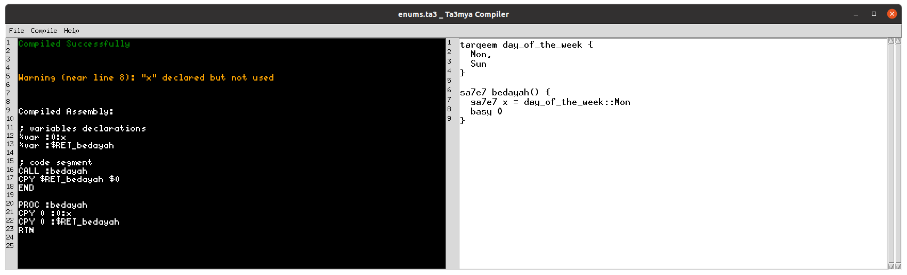

# :falafel: Ta3mya++ :falafel:
ta3mya plus plus is an implementation of a programming language using the Lex and Yacc compiler generating package.

It's the first egyptian arabic programming language.

# Language
See [methal.ta](./docs/methal.ta) for all language features.

# Requirements
- g++
- gnu-make
- bison
- flex
- python 3.8.5 (for gui)

```sh
$ sudo apt update && sudo apt install -y g++ make bison flex python3
```

# Build Compiler
```sh
$ cd src && make 
```


# Compile
## Terminal way
```sh
$ ./ta3myac path/to/file.ta
```
## Graphical way
```sh
$ cd compiler
```
```sh
$ python run.py
```

# TVM™
`Ta3myah Virtual Machine™` is a runtime for `Ta3myahAssembly™`.
For now it prints all storage after executing all commands.

To execute [methal.ta](./docs/methal.ta):
```sh
$ ./src/ta3myac ./docs/methal.ta | ./src/ta3mya
```

To execute `Ta3myahAssembly™` file directly:
```sh
$ ./src/ta3myac ./docs/methal.ta >methal.tasm
$ ./src/ta3mya ./methal.tasm
```

### File Menu
 

### Compile Menu
 

### Help Menu
 

### Success
 

### Failure
 
